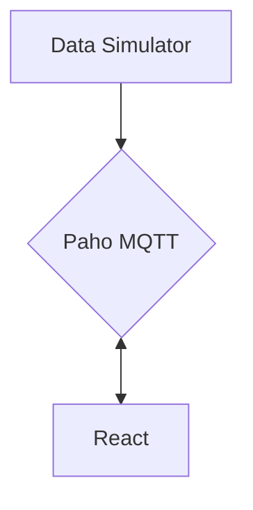

# InduPulse

The Idea of this project is simulating an Industrial Enviroment where every machine and motor has one (or more) IOT Devices getting Data and sending it into the Paho MQTT

# Project Base Architecture

src/
├── components/
│   ├── Gauge/
│   │   ├── Gauge.tsx
│   │   ├── Gauge.stories.tsx  <-- Value Simulations
│   │   └── Gauge.styles.ts
│   ├── MachineCard/
│   │   ├── MachineCard.tsx
│   │   └── MachineCard.stories.tsx <-- "play functions" for simulating updates